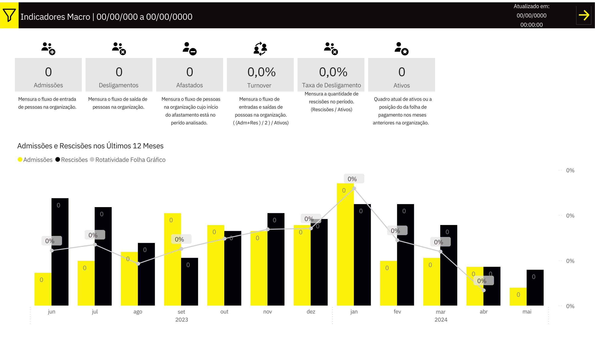

### Dashboard Description: Branch HR Indicators

**Overview:**
The Branch HR Indicators dashboard provides a detailed analysis of human resources activities over the past 12 months, including hires, terminations, turnover rates, and layoffs. This dashboard is designed to offer a clear and concise view of the inflow and outflow of employees within the organization, enabling effective and informed human resource management.

**Key Indicators:**
1. **Monthly Hires and Terminations:**
   - A bar chart illustrating the number of hires and terminations each month, allowing the visualization of trends and seasonality in the workforce.

2. **Termination Rate:**
   - The termination rate is calculated based on the number of terminations relative to the total number of active employees, providing an essential metric for understanding workforce stability.

3. **Turnover Rate:**
   - The turnover rate measures the flow of incoming and outgoing employees in the organization, giving insight into the dynamism of the team over time.

4. **Active Employees:**
   - The total number of active employees in the organization is highlighted, showing the current composition of the workforce.

5. **Employees on Leave:**
   - The metric of employees on leave indicates the number of employees temporarily out of their functions, crucial information for resource management and personnel planning.

**Additional Details:**
- **Payroll Turnover:** Includes information on the payroll position in previous months, offering a historical perspective on financial movements related to employees.

**Purpose:**
This dashboard is an essential tool for human resource managers, allowing in-depth and practical analysis of key HR indicators. It helps identify patterns, predict trends, and make strategic decisions to improve people management and organizational health.

