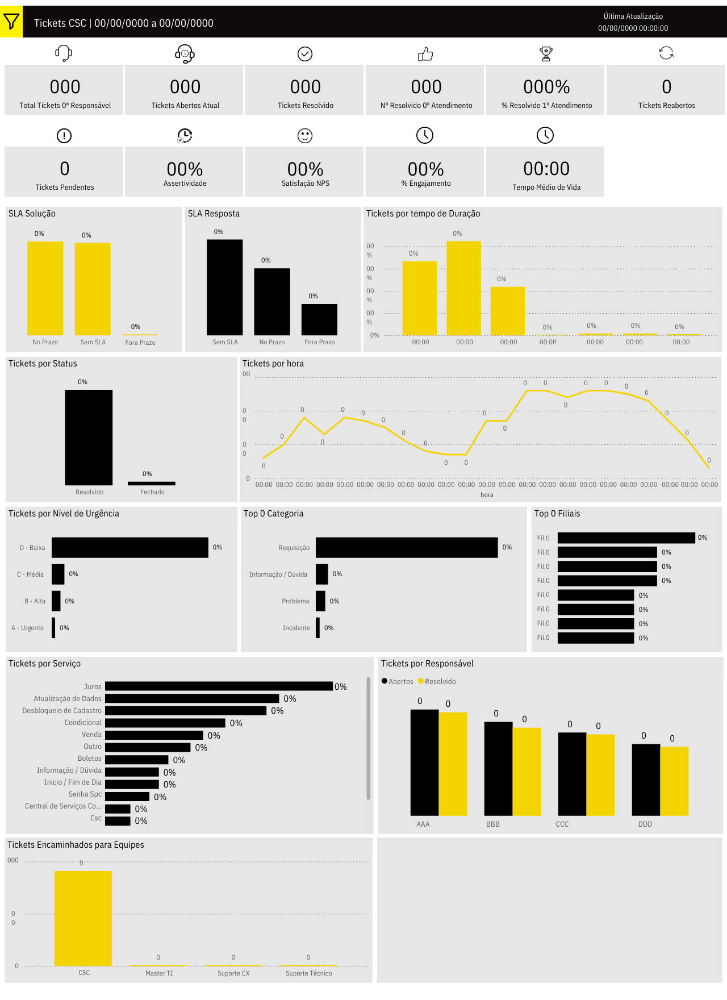

### Dashboard Description: IT Support Indicators

**Overview:**
The IT Support Indicators dashboard provides a detailed analysis of IT support tickets, focusing on various metrics such as urgency levels, categories, and time distribution. This dashboard is designed to give a clear and comprehensive view of support activities, ticket resolution efficiency, and customer satisfaction, enabling effective IT management and service improvement.

**Key Indicators:**
1. **Top Branches:**
   - Identification of the top branches based on the number of support tickets, highlighting the most active locations requiring IT support.

2. **Top Categories:**
   - Breakdown of support tickets by categories such as "Request," "Information/Query," "Problem," and "Incident," showing the types of issues most frequently reported.

3. **Tickets by Urgency Level:**
   - Analysis of tickets categorized by urgency levels (Low, Medium, High, Urgent), providing insights into the severity and priority of reported issues.

4. **Tickets by Time of Day:**
   - Visualization of ticket distribution by hour, indicating peak times for support requests and helping to optimize staffing and resource allocation.

5. **Ticket Status:**
   - Breakdown of ticket status into "Resolved" and "Closed," showing the resolution rate and efficiency of the support team.

6. **Ticket Engagement:**
   - Display of engagement metrics such as the number of open tickets, engagement percentage, and other performance indicators.

7. **Customer Satisfaction and NPS:**
   - Measurement of customer satisfaction and Net Promoter Score (NPS), providing feedback on the quality of support services.

8. **Service Level Agreement (SLA) Compliance:**
   - Analysis of SLA compliance for both solution and response times, highlighting areas where service levels are met or need improvement.

9. **Ticket Duration:**
   - Breakdown of ticket resolution times, providing insights into how quickly issues are resolved and identifying any bottlenecks.

10. **Responsibility and Resolution Rates:**
    - Analysis of tickets by responsible personnel and resolution rates, showing individual and team performance in handling support requests.

**Additional Details:**
- **Tickets by Service Type:** Insight into the distribution of tickets by service types, such as data updates, registration unlocks, and information queries.
- **Tickets Forwarded to Teams:** Visualization of the number of tickets forwarded to different teams, indicating collaboration and escalation patterns within the support structure.
- **Average Ticket Lifespan:** Measurement of the average time taken to resolve tickets, providing a view of efficiency and service speed.

**Purpose:**
This dashboard is an essential tool for IT managers, enabling detailed and practical analysis of support ticket data. It helps identify patterns, improve service quality, enhance customer satisfaction, and optimize IT support operations.

